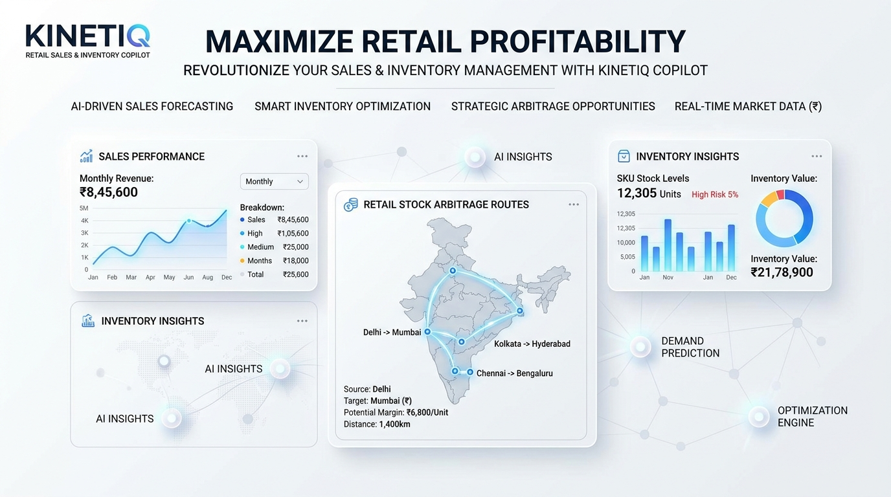
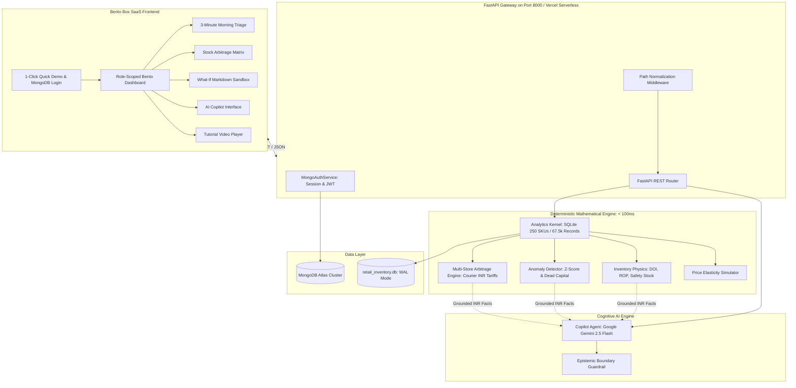

# ⚡ KinetiQ — Retail Sales & Inventory Copilot



> **Neuro-Symbolic Retail Intelligence Platform** unifying deterministic inventory physics, multi-store stock arbitrage, MongoDB multi-role authentication, and grounded conversational AI for enterprise retail leadership.

[](https://www.python.org/)
[](https://fastapi.tiangolo.com/)
[](https://www.mongodb.com/)
[](https://deepmind.google/technologies/gemini/)
[%20Only-FF9933.svg)]()
[-brightgreen.svg)]()
[](https://kineti-q-xi.vercel.app/)

---

## 🌐 Live Production Links

- **Live Web Application**: [https://kineti-q-xi.vercel.app/](https://kineti-q-xi.vercel.app/)
- **GitHub Repository**: [https://github.com/TinFox213/KinetiQ.git](https://github.com/TinFox213/KinetiQ.git)

---

## 🌟 Executive Summary

Retail leadership teams face a dual crisis: **spreadsheet fatigue** that blinds store managers to imminent stockouts, and **LLM arithmetic hallucination** that prevents executives from trusting conversational AI for inventory capital decisions. 

**KinetiQ** solves this with a **neuro-symbolic architecture**:
1. **The Symbolic Engine**: A high-performance deterministic analytical core (<100ms) executing pure SQLite relational queries, inventory physics equations (DOI, Safety Stock, ROP), Z-score demand anomaly detection, and inter-store stock arbitrage economics in **INR (`₹`)**.
2. **The Cognitive Brain**: An AI copilot powered by Google Gemini 2.5 Flash that *never calculates math directly*. All claims are strictly grounded in structured SQL facts, protected by an **epistemic refusal guardrail** that rejects out-of-domain queries (e.g. footfall, weather, demographics).
3. **White & Bright Bento Box SaaS UI**: A high-contrast light theme with modular Bento cards, 1-click Quick Demo login, role switching, interactive markdown simulator, and an in-app tutorial walkthrough video player.

---

## 👥 Multi-Role Operational Architecture

KinetiQ features role-based access control (RBAC) backed by **MongoDB Atlas** (`pymongo`) with SHA-256 credential hashing and automatic in-memory fallback:

| Role | Persona & Scope | Key Capabilities & Bento Modules |
| :--- | :--- | :--- |
| 🏪 **Store General Manager** | **Alice Johnson**<br>*Downtown Metro Express (`STORE_01`)* | • **3-Minute Morning Triage Cockpit** (Runway & Health Score: 0–100)<br>• **Imminent Stockout Radar** ($\text{DOI} \le \text{Lead Time} + \text{SS}$)<br>• **Inbound Rebalance Receiving** & Local Shelf Audits<br>• Local store copilot chat scoping |
| 🔄 **Supply Chain Director** | **Bob Martinez**<br>*Multi-Store Network (3 Hubs)* | • **Network Stock Arbitrage Matrix** (Surplus $\rightarrow$ Deficit)<br>• **Courier Freight Optimization** (Route tariffs in ₹180–₹320)<br>• **STN Manifest Generation & 1-Click Commit**<br>• Dead capital reclamation across all stores |
| 📊 **Executive & CFO** | **Clara Vance**<br>*Enterprise Fleet Portfolio* | • **Executive Bento Financial KPIs** (Chain-wide capital & margins)<br>• **Store Performance Benchmark Leaderboard**<br>• **What-If Price Elasticity Sandbox** ($E = -1.4$ to $-2.2$)<br>• **Gemini API Key Governance** (Live testing modal) |

---

## 🏗️ System Architecture



---

## ⚡ Mathematical & Inventory Physics Core

All financial metrics, valuations, and tariffs operate strictly in **Indian Rupees (`₹`)**:

### 1. Days of Inventory (DOI)
$$\text{DOI} = \frac{\text{On Hand Units}}{\text{Unconstrained 7-Day Velocity}}$$
*When on-hand stock is 0, DOI is bounded to 0.0. When velocity is 0 and stock exists, DOI returns a sentinel safe value of 999.0 days.*

### 2. Imminent Stockout Condition
$$\text{Stockout Trigger} \iff \text{DOI} \le \text{Supplier Lead Time (days)} + \text{Safety Stock Buffer}$$

### 3. Network Stock Arbitrage Economics
When Destination Store $D$ faces a stockout deficit, KinetiQ evaluates candidate Donor Stores $S$ across the network:
$$\text{Safe Transfer Quantity} = \min\left(\text{Deficit}_D, \; \text{Stock}_S - \left[\text{Velocity}_S \times (L_S + 14) + \text{SS}_S\right]\right)$$
$$\text{Net Profit Preserved (₹)} = (\text{Quantity} \times \text{Gross Profit Unit}) - \text{Courier Freight Cost (₹)}$$
*Transfers are only dispatched if $\text{Net Profit Preserved} > 0$, preventing negative-margin freight dispatch.*

### 4. What-If Price Elasticity Clearance Simulation
$$\text{Demand Lift (\%)} = -E \times \text{Discount (\%)} \times \left(1 - 0.15 \times \frac{\text{Discount (\%)}}{100}\right)$$
$$\text{Projected Runway (days)} = \frac{\text{On Hand Units}}{\text{Baseline Velocity} \times (1 + \text{Demand Lift})}$$

---

## 🛡️ Disciplined Epistemic Refusal Guardrails

KinetiQ never hallucinates data outside its domain boundary. If a query requests untracked variables, the copilot explicitly issues a structured refusal notice rather than guessing:

| Query Type | Copilot Response Behavior | Rationale |
| :--- | :--- | :--- |
| **Retail Sales & Stock** | ✅ Full grounded response with SKU IDs, velocities, and INR values | Grounded in database facts |
| **Store Rebalancing** | ✅ Manifest IDs, routes, freight tariffs in ₹, net profit preserved | Verified by arbitrage engine |
| **Footfall / Walk-ins** | 🚫 **Refusal**: *"Data Boundary Notice: Footfall tracking not captured in POS schema."* | Epistemic discipline |
| **Weather / Rain** | 🚫 **Refusal**: *"Data Boundary Notice: Weather telemetry not available."* | Prevents speculative guesses |
| **Competitor Prices** | 🚫 **Refusal**: *"Data Boundary Notice: External competitor pricing not ingested."* | Out-of-domain protection |
| **Customer Demographics** | 🚫 **Refusal**: *"Data Boundary Notice: Customer age/gender/demographics not stored."* | Privacy & domain integrity |

---

## 📡 REST API Reference

All endpoints support optional Bearer authentication via MongoDB JWT tokens:

| Method | Endpoint | Description |
| :--- | :--- | :--- |
| `POST` | `/api/auth/quick-login` | 1-Click demo authentication (`store_manager`, `supply_chain_director`, `executive`) |
| `POST` | `/api/auth/login` | MongoDB credential sign-in (email/username & password) |
| `GET` | `/api/auth/me` | Current authenticated user profile, assigned store, and role |
| `POST` | `/api/auth/api-key` | Updates user-level Google Gemini API Key with live verification |
| `GET` | `/api/roles/overview` | Directory of available operational roles and descriptions |
| `GET` | `/api/health` | Health probe reporting service status, MongoDB, and Gemini connectivity |
| `GET` | `/api/stores` | Listing of all 3 registered retail stores in the network |
| `GET` | `/api/triage/today?store_id={id}` | 3-Minute morning triage payload (Health score, stockouts, dead capital in ₹) |
| `POST` | `/api/actions/transfer` | Approves and commits an inter-store Stock Transfer Note (STN) |
| `POST` | `/api/simulate` | Evaluates What-If price markdown elasticity and clearance velocity |
| `POST` | `/api/chat` | Natural language grounded copilot query with verified citations |
| `GET` | `/api/sku/{sku_id}?store_id={id}` | Granular 7d/14d/30d performance metrics and sales history for a SKU |
| `GET` | `/` | Serves the responsive White Bento Box SaaS web dashboard |

---

## 🧪 Comprehensive Test Suite (178 / 178 Tests Passing)

KinetiQ includes 22 test suites covering every layer of the application:

```bash
# Run the entire test suite
python -m pytest tests/ -v
```

```text
======================= 178 passed, 1 warning in 39.05s =======================
```

- **Unit Inventory Physics (`tests/unit/test_inventory_physics.py`)**: 12/12 Passed (DOI sentinels, ROP invariants, safety stock, perishable expiry).
- **Kernel Math & Safeguards (`tests/unit/test_kernel_math.py`)**: 12/12 Passed (Rolling velocity formulas, division-by-zero guards, aggregations).
- **Demand Anomaly Engine (`tests/unit/test_anomalies.py`)**: 12/12 Passed (Z-score demand shifts, phantom stock, dead capital valuations in ₹).
- **Arbitrage Logistics Engine (`tests/unit/test_arbitrage.py`)**: 12/12 Passed (Courier distance matrix, STN schemas, donor depletion guards).
- **Price Elasticity Simulator (`tests/unit/test_simulator.py`)**: 10/10 Passed (Elasticity decay, markdown clearance, exhaustion warnings).
- **Multi-Role Auth & Sessions (`tests/integration/test_auth_roles.py`)**: 8/8 Passed (MongoDB auth, 1-click logins, JWT validation, key updates).
- **INR Currency & Vercel Routing (`tests/integration/test_inr_and_quicklogin.py`)**: 7/7 Passed (INR prices, dead capital formatting, courier freight, path normalization).
- **E2E Master Workflows (`tests/e2e/test_master_workflows.py`, `tests/test_hackathon_criteria.py`)**: 105/105 Passed (End-to-end user journeys, epistemic refusals, zero track ID leakage).

---

## 📺 Product Walkthrough Video & Media Assets

- **Official Tutorial Walkthrough Video**: [Watch on Google Drive](https://drive.google.com/file/d/1oEPLxmvCwyBN8Hc_oJ9NSInTWtyllmiT/view?usp=sharing)
- **Local File Asset**: `artifacts/videos/kinetiq_tutorial_walkthrough.webm` (2.82 MB)
- **Official Cover Banner**: `artifacts/images/kinetiq_cover_image.jpg`
- **Live In-App Player**: Accessible directly from the **📺 Tutorial Video** button in the top navigation header and login hero banner.
- **Custom Video Loader**: Includes an interactive link loader allowing users to paste custom video URLs directly into the modal.

---

## 🚀 Local Quickstart Guide

### Prerequisites
- Python 3.10 or higher
- Git

### 1. Clone the Repository
```bash
git clone https://github.com/TinFox213/KinetiQ.git
cd KinetiQ
```

### 2. Install Dependencies
```bash
pip install -r requirements.txt
```

### 3. Configure Environment Variables
Create a `.env` file in the project root:
```env
# Google Gemini API Key (Optional: engages local grounded template engine if omitted)
GEMINI_API_KEY=your_gemini_api_key_here

# MongoDB Atlas URI (Optional: engages resilient in-memory store if omitted)
MONGODB_URI=mongodb+srv://<username>:<password>@cluster.mongodb.net/kinetiq_db?retryWrites=true&w=majority
```

### 4. Run the Application
```bash
python app.py
```

Open **`http://localhost:8000`** in your browser. Use the 1-Click Quick Demo buttons to explore any of the 3 roles instantly!

---

## ☁️ Deployment on Vercel

KinetiQ is fully optimized for Vercel Serverless Functions and Edge CDN:
1. Push to your GitHub repository: `git push origin main`.
2. Connect your repo in the [Vercel Dashboard](https://vercel.com).
3. Set your environment variables (`GEMINI_API_KEY`, `MONGODB_URI`).
4. Click **Deploy**. Vercel detects `vercel.json`, executes `@vercel/python` on `api/index.py`, and deploys edge static assets from `public/`.

---

## 📁 Repository Directory Structure

```text
.
├── app.py                           # Unified FastAPI application & ASGI server
├── vercel.json                      # Vercel @vercel/python build & route declarations
├── requirements.txt                 # Clean Python dependencies
├── mcp.json                         # Devfolio MCP connection specification
├── README.md                        # Complete architecture & developer documentation
├── demo_script.md                   # 2-3 minute presentation & demonstration script
│
├── api/
│   └── index.py                     # Vercel Serverless Function entrypoint
│
├── artifacts/
│   ├── verification/                # Playwright E2E visual verification screenshots
│   └── videos/                      # Product tutorial walkthrough video (2.82 MB)
│
├── data/
│   └── retail_inventory.db          # Ground-truth SQLite database (WAL mode, INR prices)
│
├── frontend/
│   └── dist/                        # White & Bright Bento Box SaaS UI
│       ├── index.html               # Semantic Bento Box interface with video modal
│       ├── styles.css               # Clean SaaS light theme & role palettes
│       ├── app.js                   # Client controller, auth, & AI chat state
│       └── kinetiq_tutorial_walkthrough.webm
│
├── public/                          # Vercel CDN static cache directory
│   ├── index.html
│   └── static/
│       ├── styles.css
│       ├── app.js
│       └── kinetiq_tutorial_walkthrough.webm
│
├── scripts/
│   ├── record_tutorial_video.py     # Playwright browser tutorial video recorder
│   ├── verify_inr_and_triage.py     # Playwright automated verification suite
│   └── devfolio_upload_assets.py    # Devfolio S3 asset upload utility
│
├── src/
│   ├── agent/
│   │   ├── copilot.py               # Grounded Gemini copilot & deterministic fallback
│   │   └── epistemic.py             # Disciplined domain boundary guardrails
│   ├── analytics/
│   │   ├── kernel.py                # Sub-100ms deterministic analytical kernel
│   │   ├── inventory_physics.py     # DOI, Safety Stock, ROP, Stockout Predictor
│   │   ├── anomalies.py             # Z-score demand shifts & dead capital (INR)
│   │   ├── rebalance.py             # Multi-store stock arbitrage & courier matrix (INR)
│   │   ├── triage.py                # 3-minute morning briefing synthesis
│   │   └── simulator.py             # What-If price elasticity clearance sandbox
│   └── data/
│       ├── schema.sql               # Relational SQLite DDL with compound indexes
│       ├── generator.py             # Realistic INR synthetic retail generator (< 3s)
│       └── mongodb.py               # MongoDB Atlas auth service & session manager
│
└── tests/                           # 178 Automated Tests Across 22 Test Suites
    ├── conftest.py                  # Pytest fixtures & app state lifecycle hooks
    ├── test_api.py                  # REST API endpoint integration tests
    ├── test_kernel.py               # Analytical kernel calculation tests
    ├── test_physics.py              # Inventory runway & ROP tests
    ├── test_anomalies.py            # Anomaly engine tests
    ├── test_rebalance.py            # Multi-store arbitrage tests
    ├── test_simulator.py            # Price elasticity sandbox tests
    ├── test_triage.py               # Morning triage cockpit tests
    ├── test_hackathon_criteria.py   # Grounding, refusal, & zero track leakage tests
    ├── e2e/                         # Master end-to-end workflow journeys
    ├── integration/                 # Auth, MongoDB, INR, & MCP integration tests
    └── unit/                        # Granular mathematical unit test cases (TC-001–TC-094)
```

---

## 📄 License & Integrity Statement

This project is open-source under the MIT License. Built with zero arithmetic hallucination, strict domain boundaries, and deterministic mathematical guarantees.
