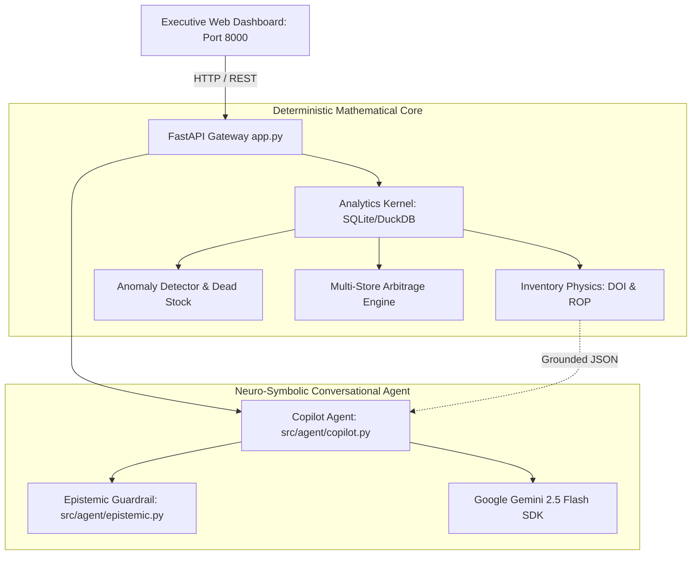

# KinetiQ — Retail Sales & Inventory Copilot

KinetiQ is a **Neuro-Symbolic Retail Copilot** that unifies deterministic inventory physics with conversational intelligence for multi-store retail store managers. It eliminates spreadsheet fatigue, prevents stockouts, unlocks stagnant capital, and enables intra-network stock transfers with zero mathematical hallucinations.

---

## ⚡ Quickstart (Single-Command Run)

Run the entire application (database seeding, analytical kernel, Gemini copilot, and embedded dashboard) on port 8000:

```bash
# 1. Install dependencies
pip install -r requirements.txt

# 2. (Optional) Set your Gemini API Key for conversational AI
# If omitted, KinetiQ automatically runs in local deterministic mode
export GEMINI_API_KEY="your-gemini-api-key"

# 3. Launch KinetiQ (cold start < 4 seconds)
python app.py
```

Then open your browser at **`http://localhost:8000`**.

---

## 🏗️ System Architecture

KinetiQ is architected on a **strict separation of concerns** between deterministic mathematical truth and linguistic reasoning:



### Core Architecture Principles:
1. **Zero-Math in the LLM:** The language model never performs arithmetic, moving averages, or projections. All calculations are executed deterministically in Python/SQL and passed as verified structured JSON.
2. **Strict Grounding:** Every claim in the copilot response quotes exact on-hand units, unconstrained 7-day velocity, and supplier lead times.
3. **Disciplined Epistemic Refusal:** If a query requests data not captured in POS/inventory records (e.g., footfall counters, weather/rainfall, competitor prices, customer demographics), the copilot politely declines rather than fabricating guesses.
4. **Inter-Store Inventory Arbitrage:** When a store faces a deficit, KinetiQ scans nearby network stores for excess idle stock, calculating courier transit fees and net profit preserved.

---

## 🚀 Key Functional Modules

### 1. Daily 3-Minute Morning Triage Cockpit
- **Health Scorecard (0–100 index):** Real-time operational health metric summarizing inventory status.
- **Top 3 Imminent Stockouts:** Flagged when Days of Inventory (DOI) $\le$ Supplier Lead Time $+$ Safety Buffer.
- **Top 3 Dead Capital Items:** Non-moving inventory ($30+$ days idle or $\text{DOI} > 90$ days) with holding cost drag (24% annual rate).
- **Demand Anomalies:** Statistical Z-score demand shifts ($|Z| \ge 2.0$) and phantom inventory detection.

### 2. Multi-Store Inventory Arbitrage
- When Store 1 experiences an imminent stockout of fast-moving items, KinetiQ evaluates surplus inventory at nearby peer stores (Store 2, Store 3).
- Ensures source stores retain adequate safety reserve ($\text{Velocity}_{7d} \times (L + 14) + \text{SS}$).
- Generates 1-click **Stock Transfer Notes (STNs)** with route, courier fee, and net profit protected.

### 3. Interactive What-If Simulation Sandbox
- Interactive slider modeling price discounts (5% to 60%) against category price elasticity ($E = -1.4$ to $-2.2$).
- Computes projected demand lift %, accelerated clearance runway, profit variance, and automated supply chain exhaustion warnings.

---

## 📡 REST API Reference

| Method | Endpoint | Description |
| :--- | :--- | :--- |
| `GET` | `/api/health` | Service health and uptime probe |
| `GET` | `/api/stores` | Directory of registered network stores |
| `GET` | `/api/triage/today?store_id=STORE_01` | Executive 3-minute morning triage briefing payload |
| `POST` | `/api/chat` | Natural language query endpoint with citation grounding |
| `POST` | `/api/actions/transfer` | Approves and commits an inter-store stock transfer |
| `POST` | `/api/simulate` | Evaluates What-If price markdown and elasticity scenario |
| `GET` | `/api/sku/{sku_id}?store_id=STORE_01` | Granular 7d/14d/30d performance metrics for a SKU |
| `GET` | `/` | Serves embedded executive dashboard |

---

## 🧪 Automated Test Suite

KinetiQ includes a comprehensive test suite with 49 unit and integration tests covering data generation, mathematical formulas, boundary refusals, arbitrage, and REST APIs:

```bash
# Run all tests
python -m pytest tests/ -v
```

Execution completes in under 12 seconds with 100% test pass rate.

---

## 📁 Repository Structure

```
.
├── app.py                      # Unified FastAPI entry point (Port 8000)
├── requirements.txt            # Minimal, robust Python dependencies
├── README.md                   # Comprehensive documentation
├── demo_script.md              # 2-3 minute presentation & demonstration script
├── data/
│   └── retail_inventory.db     # Local SQLite database (WAL mode)
├── src/
│   ├── data/
│   │   ├── schema.sql          # Relational DDL with compound indexes
│   │   └── generator.py        # Synthetic retail generator (< 2.5s)
│   ├── analytics/
│   │   ├── kernel.py           # Deterministic SQL analytical kernel
│   │   ├── inventory_physics.py# DOI, Safety Stock, ROP, Stockout Predictor
│   │   ├── anomalies.py        # Z-score demand anomalies & dead capital
│   │   ├── rebalance.py        # Multi-store inventory arbitrage engine
│   │   ├── triage.py           # 3-minute morning briefing generator
│   │   └── simulator.py        # What-If price elasticity sandbox
│   └── agent/
│       ├── epistemic.py        # Disciplined refusal boundary guardrail
│       └── copilot.py          # Gemini 2.5 Flash SDK & fallback template engine
├── frontend/
│   └── dist/
│       ├── index.html          # Executive responsive dashboard
│       ├── styles.css          # Modern dark/slate glassmorphic theme
│       └── app.js              # Client controller and API interface
└── tests/                      # 49 automated unit and integration tests
```
